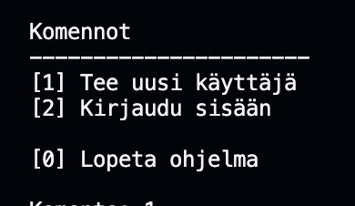

# Olio-ohjelmoinnin lopputyö taso 3
Tämä ohjelma on tehty kurssia oliot ja tietokannat varten. 
'Tehtävänä oli tehdä pelinhallintasysteemi. Alla on kuvaus ohjelmantoiminnoista ja esimerkkiajot.

## Sisältö

1. [Luokkakaavio ja arkkitehtuuri](#luokkakaavio-ja-arkkitehtuuri)
2. [Ohjelmantoiminta](#ohjelman-toiminta)
3. [Tietokanta](#tietokanta)
4. [Esimerkkiajot](#esimerkkiajo)

## Luokkakaavio ja arkkitehtuuri
 Tarkoituksena on ollut rakentaa arkkitehtuuri, jossa `main.py` on vastuussa ohjelman pyörittämisestä. `kayttaja.py`,`tavarat.py` ja `kayttajan_tavarat.py` hoitavat tiedon hakemisen ja validoimisen. `tietokanta.py` vastaa tietokannasta: CREATE,READ,UPDATE,DELETE.

Kuvassa luokkakaavio, joka sisältää kaikki luokat ja apuohjelmat.


## Ohjelman toiminta

1. `class Main`on vastuussa ohjelman käynnistämisestä, lopettamisesta, käyttäjänluomisesta ja sisäänkirjautumisesta.

2. `class KayttajaPaneeli` on vastuussa käyttäjän tietojen näyttämisestä ja tiimin vaihtamisesta.

3. `class TavaroidenHallinta` on vastuussa tavaroiden näyttämisestä, lisäämisestä ja poistamisesta.

4. `class Paakayttaja` on vastuussa tavaroiden lisäämisestä/poistamisesta tietokannasta. Pääkäyttäjäpaneelista voi myös tarkastella kaikkia tietokannasta löytyviä tavaroita ja käyttäjiä.

Kuva ohjelmalogiikasta.


## Tietokanta
Ohjelma käyttää sqlite3-tietokantaa. Tietokannassa on kolme taulua `kayttaja`, `tavarat` ja `kayttajantavarat`.

1. `kayttaja`

    |id | nimi    | salasana | rooli | tiimi         |
    |-- |---------|----------|-------|---------------|
    |1  |Momo     |1234      |Velho  |Mustat Kobrat  |
    |2  |JohnDoe  |1234      |Ritaru |Muskettisoturit|

2. `tavarat`
   
    |id | nimi | arvo |
    |-- |------|------|
    |1  |Miekka|300   |
    |2  |Kilpi |500   |

3. `kayttajatavarat`
   
    |id | kayttajan_id | tavaran_id |
    |-- |--------------|------------|
    |1  |1             |2           |
    |2  |2             |1           |


## Esimerkkiajo

### Kirjautumisvaihtoehdot
Vaihtoehtoina on uuden käyttäjänluonti tai sisäänkirjautuminen.



##### Käyttäjänluonti
Luodaan käyttäjä. Valitaan käyttäjänimi,salasana,rooli ja tiimi. Kaikilla käyttäjilla tulee olla uniikki käyttäjänimi. Ohjelma tarkistaa tämän tietokannasta.


##### Sisäänkirjautuminen
Sisäänkirjautuessa annetaan käyttäjänimi ja salasana. Nämä lähetetään tarkistettavaksi. Jos kirjautumistiedot löytyvät tietokannasta, palautetaan käyttäjän kaikki tiedot.


### Päävalikko


##### Näytä Tiedot
Sovellus näyttää käyttäjän tunnuksen,roolin ja tiimin.


##### Näytä tiimikaverit
Sovellus näyttää samassa tiimissä olevat pelaajat.


##### Vaihda tiimiä
Käyttäjä voi vaihtaa tiimiä. Uusi tiimi tallennetaan tietokantaan ja KäyttäjäPaneeli-olioon.


#### Tavaroiden hallinta


##### Näytä tavarat
Käyttäjä voi tarkastella omia tavaroitaan. Sovellus näyttää myös tavaroiden arvon, yhteenlasketun arvon ja kappalemäärän. Nämä tiedot haetaan tietokannasta.


##### Lisää tavara
Käyttäjä voi lisätä itselleen tavaroita, jotka löytyvät tietokannasta. Käyttäjä kirjoittaa tavaran nimen, jos nimi on oikein lisätään tavara käyttäjälle tietokantaan.


##### Poista tavara
Käyttäjä voi poistaa omia tavaroitaan. Käyttäjä kirjoittaa tavaran nimen, jos nimi on oikein poistetaan tavara käyttäjältä tietokannasta.


### Pääkäyttäjä
Pääkäyttäjä voi luoda tavaroita, poistaa tavaroita, nähdä kaikki tietokannassa olevat tavarat ja pelaajat. Pääkäyttäjä voi myös luoda tietokantaan taulut käyttäjiä,tavaroita ja käyttäjäntavaroita varten.

##### Sisäänkirjautuminen
pääkäyttäjälle pääsee kirjautumaan valitsemalla 9 kirjautumisvaihtoehdoissa. Tämä on piilotettu käyttäjältä. Pääkäyttäjän salasana on "paakayttaja".


#### Järjestelmänhallinta


##### Näytä kaikki tavarat
Näyttää tietokannassa olevat tavarat


##### Näytä kaikki käyttäjät
Näyttää tietokannassa olevat käyttäjät


##### Lisää tavaroita
Pyytää pääkäyttäjää syöttamään tavaran nimen ja arvon, jonka jälkeen tavara lisätään tietokantaan.


##### Poista tavaroita
Pyytää pääkäyttäjää syöttämään tavaran id:n, jonka jälkeen tavara poistetaan. Tavara poistetaan kokonaan tietokannasta, myös käyttäjien tavaroista.


##### Luo taulut
Pääkäyttäjä pystyy tarvittaessa luomaan taulut tietokantaan. Tämä komento ajetaan vain ensimmäisellä kerralla tai, jos taulut puuttuvat jostain syystä.

### Ohjelman piirteet

1. OOP -perintä
    - Ohjelmassa on käytetty paljon perintää, esimerkiksi käyttäjänluonnissa, tietokannassa ja ohjelmaluokissa.
```
#tämä koodin pätkä on kayttaja.py-tiedostosta, jossa UusiKayttaja-luokka perii luokan Kayttaja

    class UusiKayttaja(Kayttaja):
    def __init__(self,nimi,salasana,tiimi,rooli):
        super().__init__()
        self.nimi = nimi
        self.salasana = salasana
        self.tiimi = tiimi
        self.rooli = rooli
```