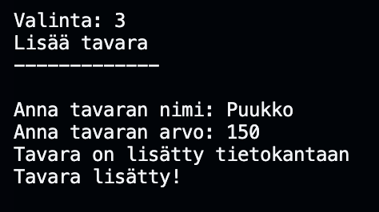

# Olio-ohjelmoinnin lopputyö taso 3
Tämä ohjelma on tehty kurssia oliot ja tietokannat varten. Alla on kattava dokumentaatio ohjelman toiminnasta.

## Sisältö


- [Olio-ohjelmoinnin lopputyö taso 3](#olio-ohjelmoinnin-lopputyö-taso-3)
  - [Sisältö](#sisältö)
  - [Luokkakaavio ja arkkitehtuuri](#luokkakaavio-ja-arkkitehtuuri)
  - [Ohjelman toiminta](#ohjelman-toiminta)
  - [Tietokanta](#tietokanta)
  - [Esimerkkiajo](#esimerkkiajo)
    - [Kirjautumisvaihtoehdot](#kirjautumisvaihtoehdot)
        - [Käyttäjänluonti](#käyttäjänluonti)
        - [Sisäänkirjautuminen](#sisäänkirjautuminen)
    - [Päävalikko](#päävalikko)
        - [Näytä Tiedot](#näytä-tiedot)
        - [Näytä tiimikaverit](#näytä-tiimikaverit)
        - [Vaihda tiimiä](#vaihda-tiimiä)
      - [Tavaroiden hallinta](#tavaroiden-hallinta)
        - [Näytä tavarat](#näytä-tavarat)
        - [Lisää tavara](#lisää-tavara)
        - [Poista tavara](#poista-tavara)
    - [Pääkäyttäjä](#pääkäyttäjä)
        - [Sisäänkirjautuminen](#sisäänkirjautuminen-1)
      - [Järjestelmänhallinta](#järjestelmänhallinta)
        - [Näytä kaikki tavarat](#näytä-kaikki-tavarat)
        - [Näytä kaikki käyttäjät](#näytä-kaikki-käyttäjät)
        - [Lisää tavaroita](#lisää-tavaroita)
        - [Poista tavaroita](#poista-tavaroita)
        - [Luo taulut](#luo-taulut)
    - [Ohjelman piirteet](#ohjelman-piirteet)
        - [1. OOP -Perintä](#1-oop--perintä)
        - [2. OOP -Polymorfismi](#2-oop--polymorfismi)
        - [3. OOP -kapsulointi](#3-oop--kapsulointi)
        - [4. OOP -Abstraktio](#4-oop--abstraktio)
        - [5. SQL -Monen-suhde-moneen](#5-sql--monen-suhde-moneen)
        - [6. SQL -Tulosjoukon esittäminen](#6-sql--tulosjoukon-esittäminen)
        - [7. SQL -Sarakelaskennan hyödyntäminen](#7-sql--sarakelaskennan-hyödyntäminen)
        - [8. SQL - Ryhmittelyn hyödyntäminen](#8-sql---ryhmittelyn-hyödyntäminen)

## Luokkakaavio ja arkkitehtuuri
 Tarkoituksena on ollut rakentaa arkkitehtuuri, jossa `main.py` on vastuussa ohjelman pyörittämisestä. `kayttaja.py`,`tavarat.py` ja `kayttajan_tavarat.py` hoitavat tiedon hakemisen ja validoimisen. `tietokanta.py` vastaa tietokannasta: CREATE,READ,UPDATE,DELETE.

Kuvassa luokkakaavio, joka sisältää kaikki luokat ja apuohjelmat.


## Ohjelman toiminta

1. `class Main`on vastuussa ohjelman käynnistämisestä, lopettamisesta, käyttäjänluomisesta ja sisäänkirjautumisesta.

2. `class KayttajaPaneeli` on vastuussa käyttäjän tietojen näyttämisestä ja tiimin vaihtamisesta.

3. `class TavaroidenHallinta` on vastuussa tavaroiden näyttämisestä, lisäämisestä ja poistamisesta.

4. `class Paakayttaja` on vastuussa tavaroiden lisäämisestä/poistamisesta tietokannasta. Pääkäyttäjäpaneelista voi myös tarkastella kaikkia tietokannasta löytyviä tavaroita ja käyttäjiä.

Kuva ohjelmalogiikasta.


## Tietokanta
Ohjelma käyttää sqlite3-tietokantaa. Tietokannassa on kolme taulua `kayttaja`, `tavarat` ja `kayttajantavarat`.

1. `kayttaja`

    |id | nimi    | salasana | rooli | tiimi         |
    |-- |---------|----------|-------|---------------|
    |1  |Momo     |1234      |Velho  |Mustat Kobrat  |
    |2  |JohnDoe  |1234      |Ritaru |Muskettisoturit|

2. `tavarat`
   
    |id | nimi | arvo |
    |-- |------|------|
    |1  |Miekka|300   |
    |2  |Kilpi |500   |

3. `kayttajatavarat`
   
    |id | kayttajan_id | tavaran_id |
    |-- |--------------|------------|
    |1  |1             |2           |
    |2  |2             |1           |


## Esimerkkiajo

### Kirjautumisvaihtoehdot
Vaihtoehtoina on uuden käyttäjänluonti tai sisäänkirjautuminen.


##### Käyttäjänluonti
Luodaan käyttäjä. Valitaan käyttäjänimi,salasana,rooli ja tiimi. Kaikilla käyttäjilla tulee olla uniikki käyttäjänimi. Ohjelma tarkistaa tämän tietokannasta.


##### Sisäänkirjautuminen
Sisäänkirjautuessa annetaan käyttäjänimi ja salasana. Nämä lähetetään tarkistettavaksi. Jos kirjautumistiedot löytyvät tietokannasta, palautetaan käyttäjän kaikki tiedot.


### Päävalikko


##### Näytä Tiedot
Sovellus näyttää käyttäjän tunnuksen,roolin ja tiimin.


##### Näytä tiimikaverit
Sovellus näyttää samassa tiimissä olevat pelaajat.


##### Vaihda tiimiä
Käyttäjä voi vaihtaa tiimiä. Uusi tiimi tallennetaan tietokantaan ja KäyttäjäPaneeli-olioon.


#### Tavaroiden hallinta


##### Näytä tavarat
Käyttäjä voi tarkastella omia tavaroitaan. Sovellus näyttää myös tavaroiden arvon, yhteenlasketun arvon ja kappalemäärän. Nämä tiedot haetaan tietokannasta.


##### Lisää tavara
Käyttäjä voi lisätä itselleen tavaroita, jotka löytyvät tietokannasta. Käyttäjä kirjoittaa tavaran nimen, jos nimi on oikein lisätään tavara käyttäjälle tietokantaan.


##### Poista tavara
Käyttäjä voi poistaa omia tavaroitaan. Käyttäjä kirjoittaa tavaran nimen, jos nimi on oikein poistetaan tavara käyttäjältä tietokannasta.


### Pääkäyttäjä
Pääkäyttäjä voi luoda tavaroita, poistaa tavaroita, nähdä kaikki tietokannassa olevat tavarat ja pelaajat. Pääkäyttäjä voi myös luoda tietokantaan taulut käyttäjiä,tavaroita ja käyttäjäntavaroita varten.

##### Sisäänkirjautuminen
pääkäyttäjälle pääsee kirjautumaan valitsemalla 9 kirjautumisvaihtoehdoissa. Tämä on piilotettu käyttäjältä. Pääkäyttäjän salasana on "paakayttaja".


#### Järjestelmänhallinta


##### Näytä kaikki tavarat
Näyttää tietokannassa olevat tavarat


##### Näytä kaikki käyttäjät
Näyttää tietokannassa olevat käyttäjät


##### Lisää tavaroita
Pyytää pääkäyttäjää syöttamään tavaran nimen ja arvon, jonka jälkeen tavara lisätään tietokantaan.



##### Poista tavaroita
Pyytää pääkäyttäjää syöttämään tavaran id:n, jonka jälkeen tavara poistetaan. Tavara poistetaan kokonaan tietokannasta, myös käyttäjien tavaroista.


##### Luo taulut
Pääkäyttäjä pystyy tarvittaessa luomaan taulut tietokantaan. Tämä komento ajetaan vain ensimmäisellä kerralla tai, jos taulut puuttuvat jostain syystä.

### Ohjelman piirteet

##### 1. OOP -Perintä
- Ohjelmassa on käytetty paljon perintää, esimerkiksi käyttäjänluonnissa, tietokannassa ja ohjelmaluokissa.
```
#tämä koodin pätkä on kayttaja.py-tiedostosta, jossa UusiKayttaja-luokka perii luokan Kayttaja

    class UusiKayttaja(Kayttaja):
    def __init__(self,nimi,salasana,tiimi,rooli):
        super().__init__()
        self.nimi = nimi
        self.salasana = salasana
        self.tiimi = tiimi
        self.rooli = rooli
```

##### 2. OOP -Polymorfismi
- Polymorfismi tulee parhaiten esiin tietokanta.py-tiedossa.

    ```
    # class Tietokanta määrittää yhteyden ja kursorin sqliteen, jota kaikki muut tietokanta.py-tiedostossa olevat luokat käyttävät.

    class Tietokanta():
        def __init__(self):
            self.conn = sqlite3.connect("kanta.db")
            self.curs = self.conn.cursor()

    class KayttajaTaulu(Tietokanta):
        def __init__(self):
            super().__init__()

        def varmenna_kayttaja(self, nimi, salasana):
        # Tässä käytetään yhteyttä with komennolla. Yhteys on määritetty Tietokanta-luokassa
        with self.conn:
            self.curs.execute("SELECT id,nimi,tiimi,rooli FROM kayttajat WHERE nimi=:nimi and salasana=:salasana ",{'nimi':nimi,'salasana':salasana})
            vastaus = self.curs.fetchone()
            if vastaus == None:
                return False
            else:
                return list(vastaus)
    ```
##### 3. OOP -kapsulointi
- Ohjelmassa ei alunperin ollut kapsulointia, mutta se on lisätty jälkikäteen.

    ```
    #Kapsulointi estää muokkaamisen luokan ja aliluokan ulkopuolelta.

    class KayttajaPaneeli():
        def __init__(self,id,nimi,tiimi,rooli):
        self._id = id
        self._nimi = nimi
        self.tiimi = tiimi
        self._rooli = rooli
        self.kayttaja = Kayttaja()
    ```
##### 4. OOP -Abstraktio
- Ohjelma ei sisällä abstraktiota. Ohjelmaan olisi voinut lisätä abstraktion, mutta se jäi tällä kertaa. `Class Tietokanta` voisi olla abstrakti pienellä muokkaamisella. Sitä ei käytetä ohjelman suoritus vaiheessa ollenkaan, mutta sisältää tärkeitä funktioita, kuten taulujen luomisen.

##### 5. SQL -Monen-suhde-moneen
- Monen-suhde-moneen toteutuu `kayttajantavarat` taulussa. Tauluun tulee id, käyttäjän id ja tavaran id. Kun taulusta halutaan hakea käyttäjän tavarat, yhdistetään taulut `tavarat`ja `kayttajantavarat`.

    ```
    # Tässä funktio käyttää saamaansa käyttäjän id:tä löytääkseen käyttäjän tavarat.

    def hae_kayttajan_tavarat_taulusta(self, kayttajan_id):
        with self.conn:
            self.curs.execute("SELECT tavarat.nimi, tavarat.arvo FROM tavarat JOIN kayttajantavarat ON kayttajantavarat.tavaran_id = tavarat.id  WHERE kayttajantavarat.kayttajan_id =:kayttajan_id", {'kayttajan_id': kayttajan_id})
            loydetyt_tavarat = list(self.curs.fetchall())
            return loydetyt_tavarat
    ```

##### 6. SQL -Tulosjoukon esittäminen
- Ohjelmassa tulosjoukkoja rajataan enimmäkseen `WHERE`-lausekkeella. Lisäksi ohjelma käyttää toimintoa `MAX` toimintoa, jonka avulla se hakee korkeimman id:n tietokannasta. Tämän avulla tietokantaan ei päädy tiedostoja, joilla on sama id.

    ```
    # SELECT MAX(id) etsii suurimman id:n tietokannasta, jonka jälkeen siihen lisätään + 1. Jos tauluun ei ole tallennettu mitään, annetaan id:ksi 1.

    def lisaa_tietokantaan_tavara(self,nimi,arvo):
        with self.conn:
            self.curs.execute("SELECT MAX(id) as maxid FROM tavarat")
            hae_id = (self.curs.fetchone())
            taulu_id = 1
            if hae_id[0] == None:
                taulu_id = 1
            else:
                taulu_id = hae_id[0]
                taulu_id+=1
            self.curs.execute("INSERT INTO tavarat VALUES (:id,:nimi,:arvo)", {'id': taulu_id,'nimi': nimi,'arvo':arvo})
            self.conn.commit()

    #Tämä funktio varmistaa, että käyttäjätunnus ja salasana ovat oikein. Tietokannasta etsitään nimen ja salasanan avulla, ja palutetaan löytyneet vastaukset.

    def varmenna_kayttaja(self, nimi, salasana):
        with self.conn:
            self.curs.execute("SELECT id,nimi,tiimi,rooli FROM kayttajat WHERE nimi=:nimi and salasana=:salasana ",{'nimi':nimi,'salasana':salasana})
            vastaus = self.curs.fetchone()
            if vastaus == None:
                return False
            else:
                return list(vastaus)
    ```
##### 7. SQL -Sarakelaskennan hyödyntäminen
- Ohjelma käyttää sarakelaskentaa, silloin kun tarvitaan käyttäjän tavaroiden yhteenlaskettu arvo ja kappalemäärä.
  
    ```
    #Tämä funktio laskee tavaroiden arvon yhteensä ja tavaroiden määrän.

    def tavaroiden_arvo(self, kayttajan_id):
        with self.conn:
            self.curs.execute("SELECT SUM(tavarat.arvo) FROM tavarat JOIN kayttajantavarat ON kayttajantavarat.tavaran_id = tavarat.id  WHERE kayttajantavarat.kayttajan_id =:kayttajan_id", {'kayttajan_id': kayttajan_id})
            tavarat_arvo = (self.curs.fetchone())
            self.curs.execute("SELECT COUNT(tavarat.arvo) FROM tavarat JOIN kayttajantavarat ON kayttajantavarat.tavaran_id = tavarat.id  WHERE kayttajantavarat.kayttajan_id =:kayttajan_id", {'kayttajan_id': kayttajan_id})
            tavarat_maara = (self.curs.fetchone())
            if tavarat_arvo[0] == None:
                return [0,0]
            else:
                return [tavarat_arvo[0],tavarat_maara[0]]
    ```

##### 8. SQL - Ryhmittelyn hyödyntäminen
- Ohjelma ei käytä ryhmittelyä hyväksi. Ryhmittelyä olisi voinut käyttää esimerkiksi tavaroiden järjestämiseen arvon mukaan, mutta se ei ole tällä kertaa mukana.        
